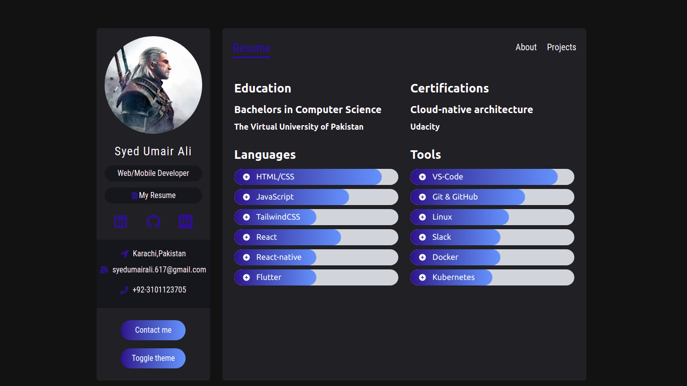
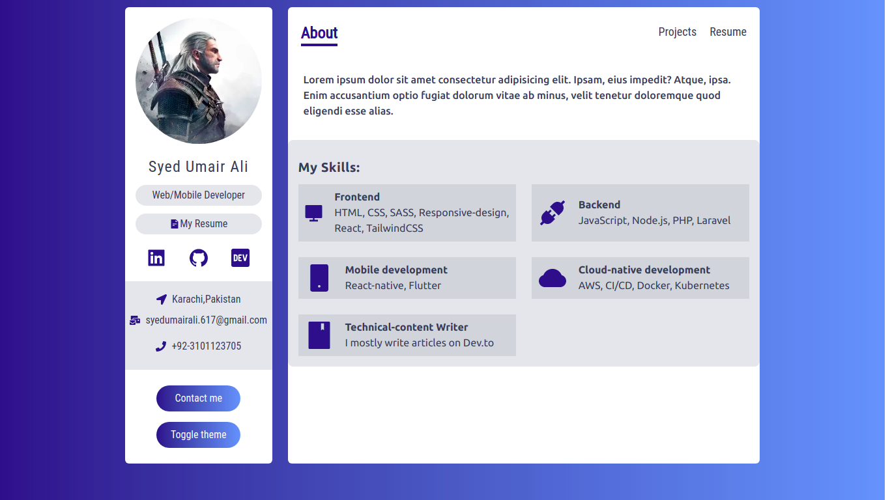
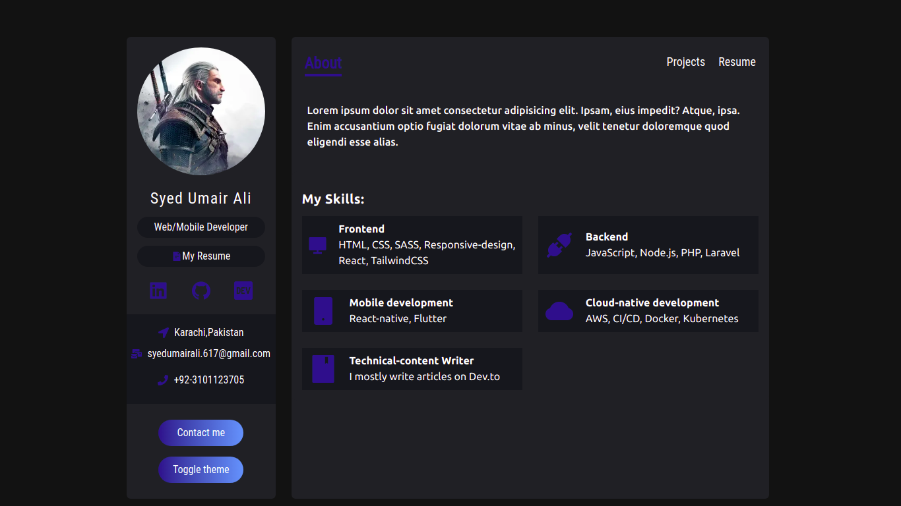
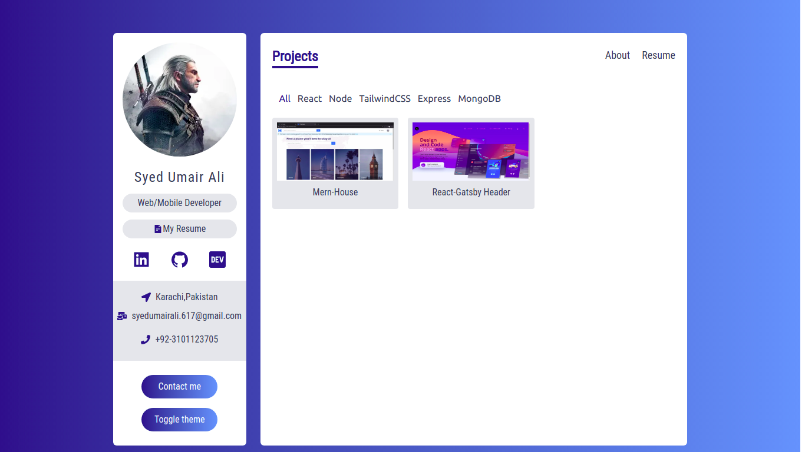

# Nxt Portfolio

A modern looking personal portfolio built using Next.js, TailwindCSS, TypeScript, and FramerMotion

## Getting Started

First, run the development server:

```bash
npm run dev
# or
yarn dev
```

Open [http://localhost:3000](http://localhost:3000) with your browser to see the result.

## Technologies Used

- [React.js](https://reactjs.org/)
- [Next.js](https://nextjs.org/)
- [TailwindCSS](https://tailwindcss.com/)
- [TypeScript](https://www.typescriptlang.org/)
- [Framer Motion](https://www.framer.com/motion/)

## Screen Shots







## Deployment

Live Site:

Link 1: [Vercel version](https://nxt-portfolio.vercel.app/)
Link 2: [Netlify version](https://nxt-portfolio.netlify.app/)
